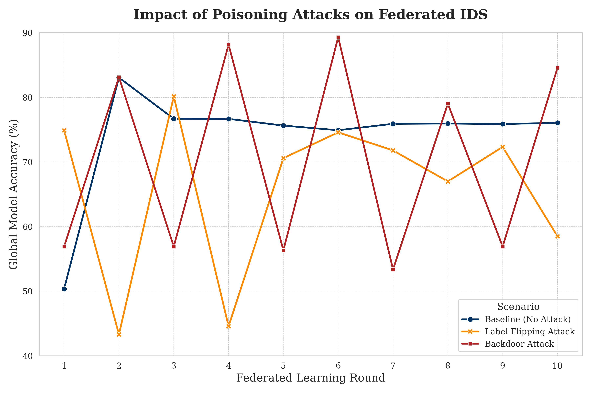

# Poisoning-Resistant Federated Intrusion Detection System (PR-FIDS)

## Secure your FL-based IDS against data poisoning attacks with an adaptive 3-layer defense.

This repository provides a complete implementation of a **Poisoning-Resistant Federated Intrusion Detection System (PR-FIDS)**. It demonstrates how to build a robust, privacy-preserving, and collaborative Intrusion Detection System (IDS) using Federated Learning (FL), fortified with an adaptive, multi-layered defense system to protect against sophisticated data poisoning attacks.

---

## Table of Contents
1. [Project Overview](#1-project-overview)
2. [Key Features](#2-key-features)
3. [The Problem: Poisoning Federated Learning](#3-the-problem-poisoning-federated-learning)
4. [The Solution: An Adaptive 3-Layer Defense](#4-the-solution-an-adaptive-3-layer-defense)
5. [Results: The Effectiveness of the Defense](#5-results-the-effectiveness-of-the-defense)
6. [System Architecture](#6-system-architecture)
7. [Getting Started](#7-getting-started)
    - [Prerequisites](#prerequisites)
    - [Installation](#installation)
    - [Dataset](#dataset)
8. [How to Run Simulations](#8-how-to-run-simulations)
9. [Project Structure](#9-project-structure)
10. [Detailed Documentation](#10-detailed-documentation)

---

## 1. Project Overview

Federated Learning (FL) offers a powerful paradigm for collaborative machine learning, allowing multiple parties to collectively train a robust model without sharing their raw, sensitive data. This makes FL an ideal candidate for developing an Intrusion Detection System (IDS) that can learn from diverse network environments while preserving privacy.

However, this decentralized trust model introduces a critical vulnerability: **data poisoning attacks**. Malicious clients can submit corrupted model updates, degrading the performance, reliability, and integrity of the central global model.

This project implements a comprehensive FL-based IDS to illustrate:
- The effective operation of a standard FL system in an ideal, benign environment.
- The devastating impact of two potent poisoning attack vectors: **Label Flipping** and **Backdoor Injection**.
- The successful deployment and efficacy of a novel, multi-layered defense system designed to neutralize these attacks and secure the FL training process.

---

## 2. Key Features

-   **Federated IDS Implementation:** A `CNN-LSTM` deep learning model specifically designed for intrusion detection, collaboratively trained using the widely adopted Federated Averaging (FedAvg) algorithm.
-   **Realistic Poisoning Attacks:** Simulation of two critical attack scenarios:
    -   **Label Flipping:** Malicious clients intentionally mislabel `attack` samples as `normal`, corrupting the model's ability to detect threats.
    -   **Backdoor Injection:** Adversarial clients embed a hidden trigger into the model, creating a subtle vulnerability that can be exploited later.
-   **Adaptive 3-Layer Defense System:** A synergistic and robust defense mechanism:
    -   **Layer 1 (Client Fingerprinting):** Passively monitors and analyzes the consistency and characteristics of client model updates to identify anomalous behavior.
    -   **Layer 2 (Adaptive Honeypot):** Actively probes suspicious client models against a small, trusted dataset. This layer employs a dynamic, relative performance baseline to accurately distinguish malicious updates from legitimate data variations.
    -   **Layer 3 (Robust Aggregation):** Utilizes the trust scores and anomaly detections from the preceding layers to perform a weighted aggregation of model updates, effectively down-weighting or outright rejecting contributions from identified malicious clients.

---

## 3. The Problem: Poisoning Federated Learning

A fundamental assumption in standard Federated Learning is trust among participating clients. Without protective measures, the central server blindly averages all incoming model updates. Our simulations vividly demonstrate that even with a modest 30% of malicious clients, the global model's performance becomes highly unstable and unreliable, rendering it ineffective for real-world deployment.


> **Figure 1:** This plot illustrates the global model's accuracy under different attack scenarios. Compared to the stable blue **Baseline**, the undefended **Label Flipping (orange)** and **Backdoor (red)** attacks introduce extreme performance volatility and significant accuracy drops, making the model untrustworthy.

---

## 4. The Solution: An Adaptive 3-Layer Defense

Our innovative solution is a synergistic defense system where each layer compensates for potential weaknesses in others. The core innovation lies within the **adaptive honeypot** (Layer 2), which establishes a dynamic performance baseline. This allows it to precisely differentiate between genuinely malicious updates and normal variations arising from diverse client data distributions. The reliable trust signals generated by this layer are then fed to the robust aggregation layer (Layer 3), which intelligently mitigates the attack by appropriately weighting or entirely ignoring malicious contributions, thereby safeguarding the global model.

---

## 5. Results: The Effectiveness of the Defense

The conclusive results unequivocally demonstrate the success of our multi-layered defense system. The adaptive 3-layer defense effectively neutralizes both Label Flipping and Backdoor poisoning attacks, stabilizing the training process and restoring the model's accuracy to its optimal baseline level, even in the presence of determined adversaries.


> **Figure 2:** The final "hero plot" showcasing defense effectiveness. The dashed orange and red lines represent the undefended attacks. The solid **green (Defended Label Flipping)** and **purple (Defended Backdoor)** lines illustrate our system's performance under the same attacks. They successfully absorb the adversarial impact and converge to the same high, stable accuracy as the blue baseline, proving the defense's efficacy.

---

## 6. System Architecture

The project is structured around a central FL server, multiple FL clients, and dedicated modules for data handling, attack simulation, and defense mechanisms.

-   **`fl_server.py`:** Manages client connections, orchestrates the federated learning rounds, aggregates model updates, and incorporates the defense layers.
-   **`fl_client.py`:** Represents individual participating entities. It loads local data, trains the IDS model, and sends updates to the server. Can be configured to act maliciously.
-   **`ids_model.py`:** Defines the architecture of the `CNN-LSTM` deep learning model used for intrusion detection.
-   **`defenses.py`:** Encapsulates the logic for the three-layered adaptive defense system, including client fingerprinting, the adaptive honeypot, and robust aggregation.
-   **`attacks.py`:** Contains the implementation details for the Label Flipping and Backdoor poisoning attacks.
-   **`data_loader.py`:** Handles preprocessing, normalization, and distribution of the NSL-KDD dataset to simulate client-specific data partitions.

---

## 7. Getting Started

Follow these steps to set up the project and run simulations on your local machine.

### Prerequisites
-   Python 3.10+
-   [uv](https://github.com/astral-sh/uv) (highly recommended for fast package management) or `pip`

### Installation

1.  **Clone the repository:**
    ```bash
    git clone https://github.com/vishwajitsarnobat/PR-FIDS.git
    cd PR-FIDS
    ```

2.  **Create and activate a virtual environment:**
    Using `uv` (recommended):
    ```bash
    uv venv
    source .venv/bin/activate
    ```
    Or using Python's built-in `venv`:
    ```bash
    python -m venv .venv
    source .venv/bin/activate
    ```
    *(Note: Refer to the official [uv Installation Guide](https://docs.astral.sh/uv/getting-started/installation/) if `uv` is not already installed.)*

3.  **Install the required packages:**
    Make sure `requirements.txt` is in the root directory (it should be included in the repository).
    Using `uv`:
    ```bash
    uv sync
    ```
    Or using `pip`:
    ```bash
    pip install -r requirements.txt
    ```

### Dataset

This project utilizes the **NSL-KDD Dataset** for intrusion detection. You need to download it manually.

1.  Visit the [NSL-KDD Dataset Page on Kaggle](https://www.kaggle.com/datasets/hassan06/nslkdd).
2.  Download the entire dataset zip file.
3.  Extract the contents and locate `KDDTrain+.txt` and `KDDTest+.txt`.
4.  Place *both* `KDDTrain+.txt` and `KDDTest+.txt` directly into the root directory of this project (e.g., `PR-FIDS/KDDTrain+.txt`).

---

## 8. How to Run Simulations

All simulation configurations and execution are managed through `main.py`.

1.  **Configure the Simulation Scenarios:**
    Open `main.py` and modify the `scenarios_to_run` list to specify which experiments you wish to execute. The available scenarios are:
    -   `"baseline"`: Standard FL without attacks or defenses.
    -   `"attack_label_flipping"`: FL under Label Flipping attack, no defense.
    -   `"attack_backdoor"`: FL under Backdoor attack, no defense.
    -   `"defended_label_flipping"`: FL under Label Flipping attack, with our 3-layer defense.
    -   `"defended_backdoor"`: FL under Backdoor attack, with our 3-layer defense.

    Example:
    ```python
    scenarios_to_run = ["baseline", "defended_label_flipping"]
    ```

2.  **Run the Selected Simulations:**
    Execute the main script from your activated virtual environment in the terminal:
    ```bash
    # Using uv (recommended)
    uv run main.py

    # Or using python (e.g., on Linux/macOS)
    python3 main.py
    ```
    *(Note: On Windows systems, you might use `python main.py` instead of `python3 main.py`.)*
    This process will run the selected scenarios, logging progress to the console and saving the aggregated results to `simulation_results.csv`.

3.  **Generate Performance Plots:**
    After the simulation completes, run the analysis script to visualize the results:
    ```bash
    # Using uv (recommended)
    uv run results_analysis.py

    # Or using python (e.g., on Linux/macOS)
    python3 results_analysis.py
    ```
    This script will read `simulation_results.csv` and generate the performance plots (like Figure 1 and Figure 2 above), saving them as PNG files in the root directory.

---

## 9. Project Structure

```
.
├── main.py                 # Master script for configuring and executing all FL scenarios.
├── results_analysis.py     # Script to process simulation results and generate insightful plots.
├── fl_server.py            # Implements the Federated Learning server logic, including aggregation and defense coordination.
├── fl_client.py            # Defines the Federated Learning client behavior, handling local model training and updates.
├── ids_model.py            # Contains the definition of the CNN-LSTM deep learning model used for IDS.
├── defenses.py             # Houses the implementation of the adaptive 3-layer defense system.
├── attacks.py              # Provides the logic for simulating Label Flipping and Backdoor poisoning attacks.
├── data_loader.py          # Script for loading, preprocessing, and partitioning the NSL-KDD dataset.
├── requirements.txt        # Lists all Python dependencies required for the project.
├── KDDTrain+.txt           # NSL-KDD training dataset (must be downloaded).
├── KDDTest+.txt            # NSL-KDD test dataset (must be downloaded).
└── README.md               # This README file.
```

---

## 10. Detailed Documentation

For an in-depth understanding of the methodology, development journey and analysis, please refer to our comprehensive documentation:

[Google Docs Link](https://docs.google.com/document/d/1iCbQGVKUGMK30eZ7k4ftov1jacLfs7PTE505NhOsCA/edit?usp=sharing)

---